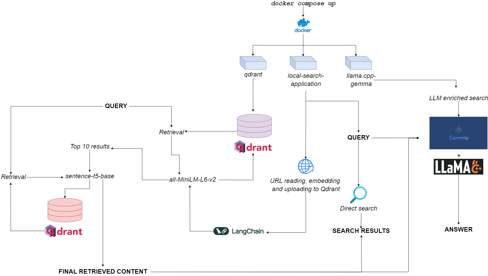
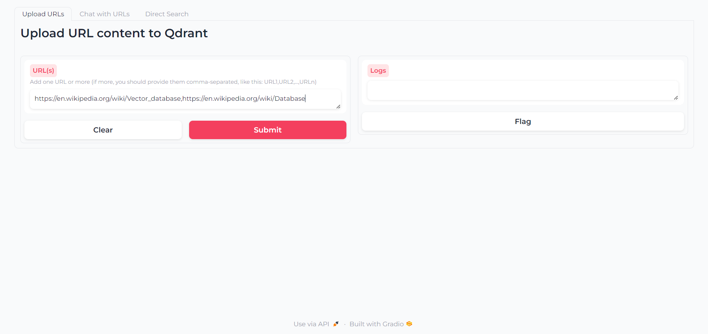
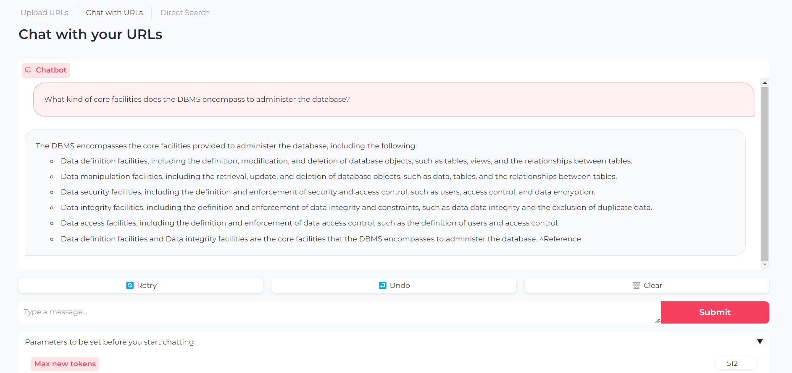
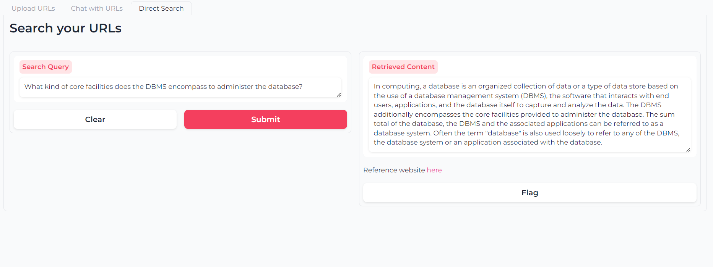

<h1 align="center">qdurllm</h1>
<h2 align="center">Search your favorite websites and chat with them, on your desktop🌐</h2>


<div align="center">
    
   
   
   
   
   
   <div>
        
        <p><i>Flowchart for qdurllm</i></p>
   </div>
</div>

**qdurllm** (**Qd**rant **URL**s and **L**arge **L**anguage **M**odels) is a local search engine that lets you select and upload URL content to a vector database: after that, you can search, retrieve and chat with this content.

This is provisioned through a multi-container Docker application, leveraging Qdrant, Langchain, llama.cpp, quantized Gemma and Gradio.

## Demo!

Head over to the [demo space on HuggingFace](https://huggingface.co/spaces/as-cle-bert/qdurllm-demo)🦀

## Requirements

The only requirement is to have `docker` and `docker-compose`.

If you don't have them, make sure to install them [here](https://docs.docker.com/get-docker/).

## Installation

You can install the application by cloning the GitHub repository

```bash
git clone https://github.com/AstraBert/qdurllm.git
cd qdurllm
```

Or you can simply paste the following text into a `compose.yaml` file:

```yaml
networks:
  mynet:
    driver: bridge
services:
  local-search-application:
    image: astrabert/local-search-application
    networks:
      - mynet
    ports:
      - "7860:7860"
  qdrant:
    image: qdrant/qdrant
    ports:
      - "6333:6333"
    volumes:
      - "./qdrant_storage:/qdrant/storage"
    networks:
      - mynet
  llama_server:
    image: astrabert/llama.cpp-gemma
    ports:
      - "8000:8000"
    networks:
      - mynet
```

Placing the file in whatever directory you want in your file system.

Prior to running the application, you can optionally pull all the needed images from Docker hub:

```bash
docker pull qdrant/qdrant
docker pull astrabert/llama.cpp-gemma
docker pull astrabert/local-search-application
```

## How does it work?

When launched (see [Usage](#usage)), the application runs three containers:

- `qdrant`(port 6333): serves as vector database provider for semantic search-based retrieval
- `llama.cpp-gemma`(port 8000): this is an implementation of a [quantized Gemma model](https://huggingface.co/lmstudio-ai/gemma-2b-it-GGUF) provided by LMStudio and Google, served with `llama.cpp` server. This works for text-generation scopes, enriching the search experience of the user.
- `local-search-application`(port 7860): a Gradio tabbed interface with:
    + The possibility to upload one or multiple contents by specifying the URL (thanks to Langchain)
    + The possibility to chat with the uploaded URLs thanks to `llama.cpp-gemma`
    + The possibility to perform a direct search that leverages double-layered retrieval with `all-MiniLM-L6-v2` (that identifies the 10 best matches) and `sentence-t5-base` (that re-encodes the 10 best matches and extracts the best hit from them) - this is the same RAG implementation used in combination with `llama.cpp-gemma`. Wanna see how double-layered RAG performs compared to single-layered RAG? Head over [here](./double-layered-rag-benchmarks/)!

> _The overall computational burden is light enough to make the application run not only GPUless, but also with low RAM availability (>=8GB, although it can take up to 10 mins for Gemma to respond on 8GB RAM)._ 

## Usage

### Run it

You can make the application work with the following - really simple - command, which has to be run within the same directory where you stored your `compose.yaml` file:

```bash
docker compose up -d
```

If you've already pulled all the images, you'll find the application running at `http://localhost:7860` or `http://0.0.0.0:7860` in less than a minute. 

If you have not pulled the images, you'll have to wait that their installation is complete before actually using the application.

### Use it

Once the app is loaded, you'll find a first tab in which you can write the URLs whose content you want to interact with:



Now that your URLs are uploaded, you can either chat with their content through `llama.cpp-gemma`:



> _Note that you can also set parameters like maximum output tokens, temperature, repetition penalty and generation seed_

Or you can use double-layered-retrieval semantic search to query your URL content(s) directly:



## License and rights of usage

The software is (and will always be) open-source, provided under [MIT license](./LICENSE).

Anyone can use, modify and redistribute any portion of it, as long as the author, [Astra Clelia Bertelli](https://astrabert.vercel.app) is cited.

## Contributions and funding

Contribution are always more than welcome! Feel free to flag issues, open PRs or [contact the author](mailto:astra.bertelli01@universitadipavia.it) to suggest any changes, request features or improve the code.

If you found the application useful, please consider [funding it](https://github.com/sponsors/AstraBert) in order to allow improvements!
